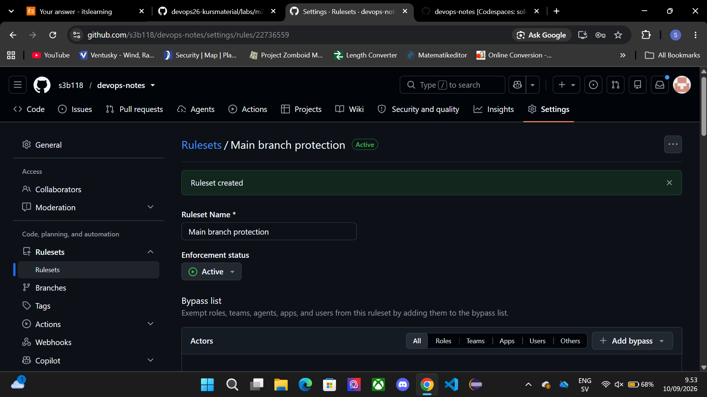
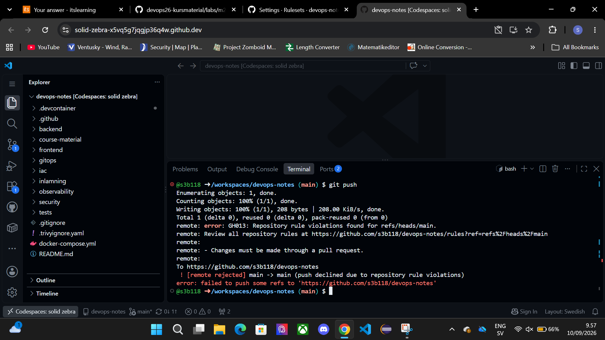
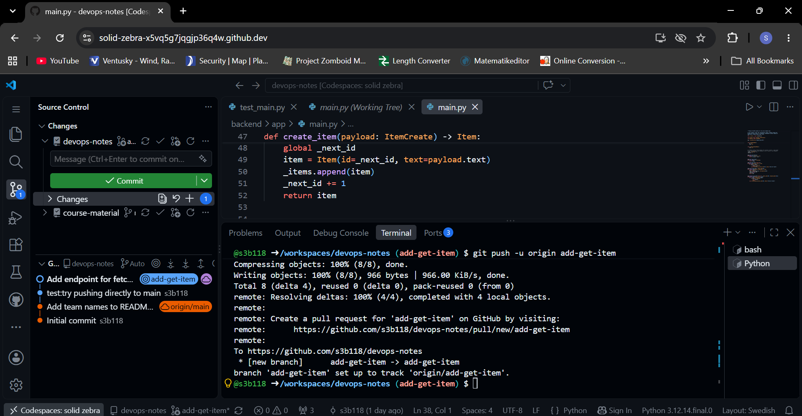
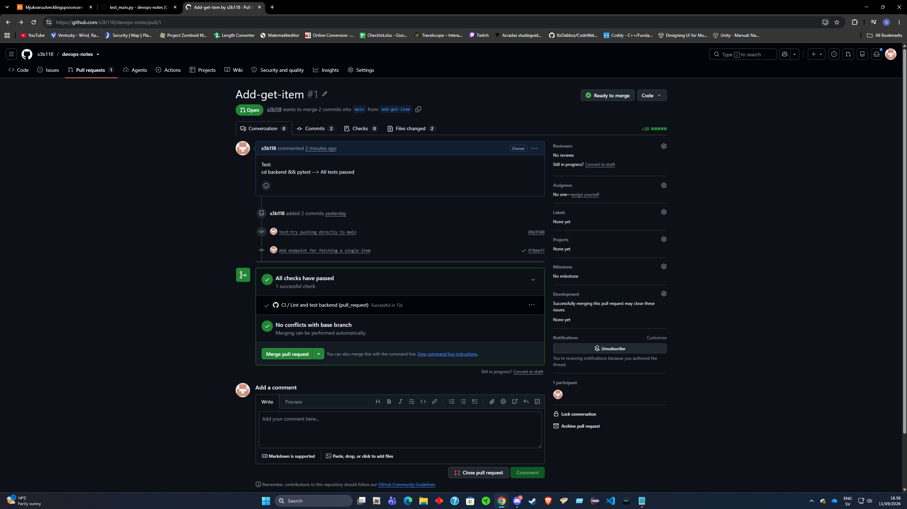
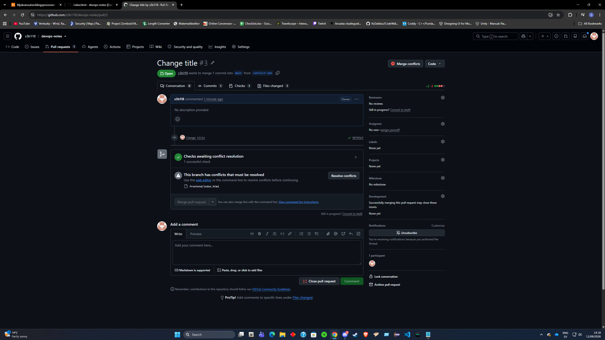

Aktiverade branch protection, testade skydd för main branch, skapade PR (solo), gjorde review och merge, skapade och löste konflikt, skapade tagg för lab/miltstolpe 2 (m2). Använde GitHub codespace (browser) för CLI (bash) och filhantering. Allting gick som förväntat förutom ett problem med Python indentation i main.py.

Steg 1:

Steg 2:

Steg 3:

¨
Steg 4:

Steg 5:

