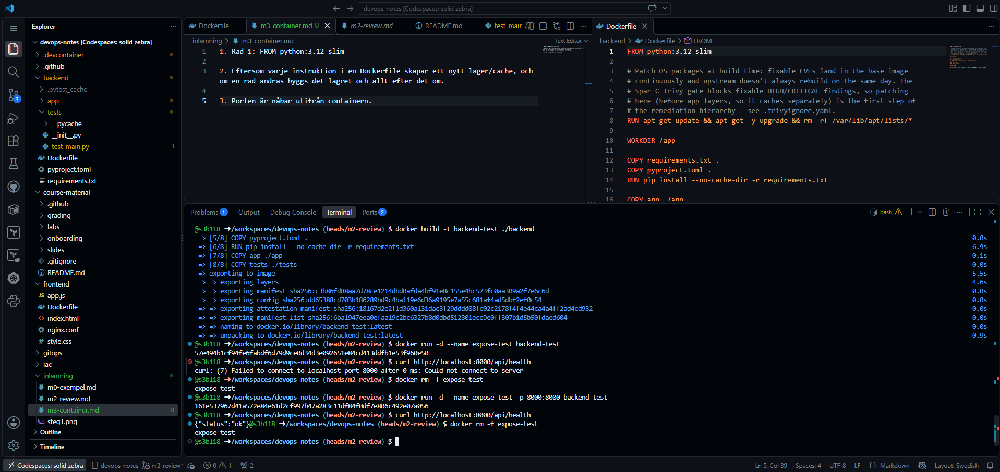
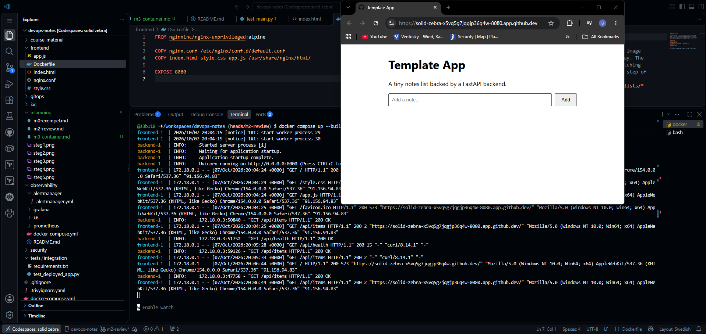
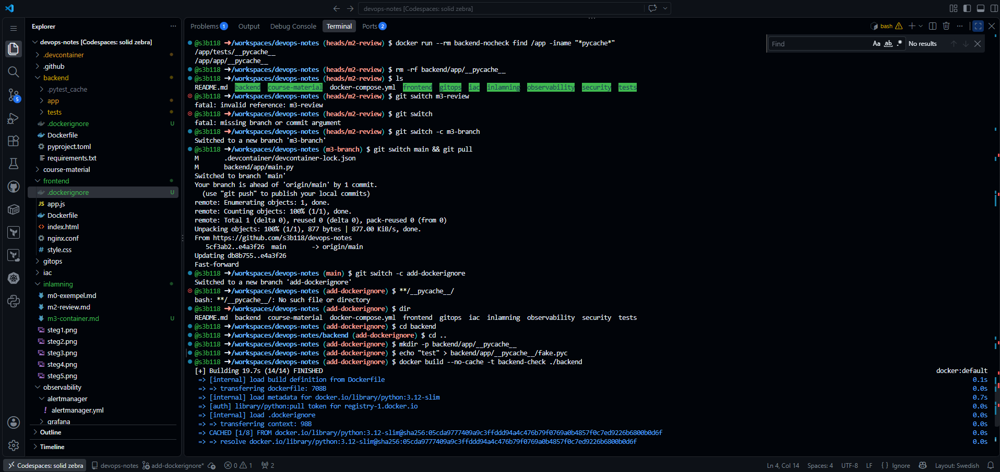
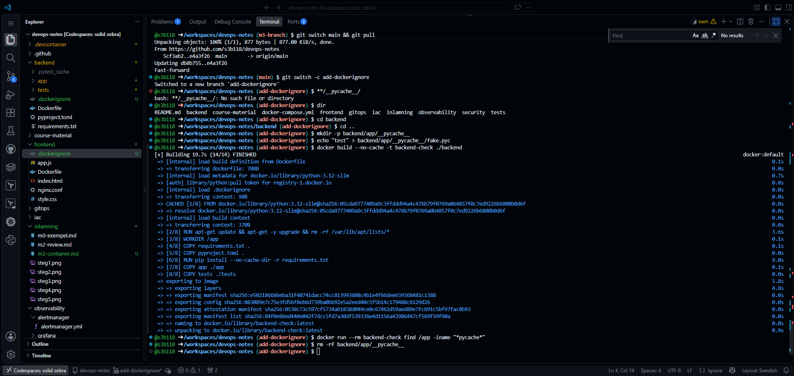
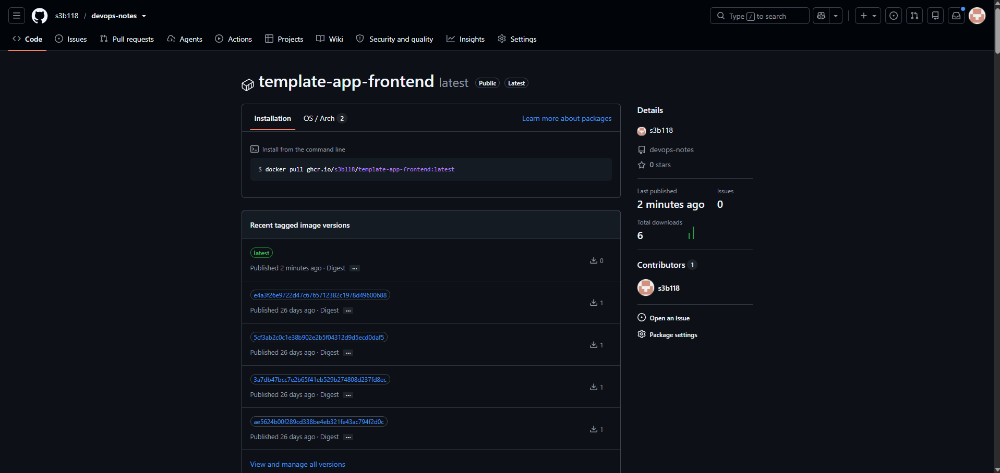

1. Rad 1: FROM python:3.12-slim

2. Eftersom varje instruktion i en Dockerfile skapar ett nytt lager/cache, och om en rad ändras byggs det lagret och allt efter det om.

3. Porten är nåbar utifrån containern.

Steg 1:

Läste dockerfile för backend och testade connection till localhost/8000 före och efter att porten publiceras.

Steg 3:

Körde appen med docker compose up --build och körde curl på localhost:8080 för att verfiera att båda tjänsterna är igång.

Steg 4:

Skapade en dockerignore för backend och frontend för att förhindra att Docker kopierar allting i onödan.

Steg 5:

Loggade in och pushade till GHCR, skapade en token och verifierade att ":latest" syns i versions-fliken för packages.