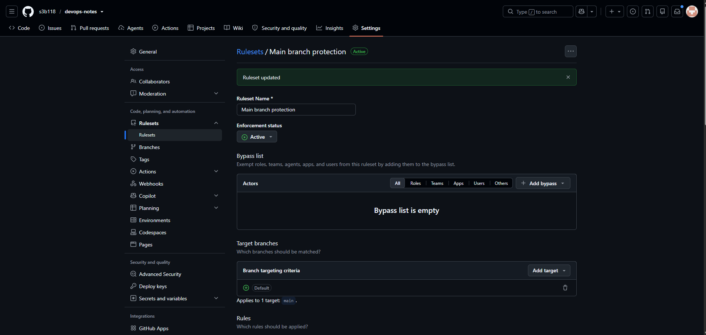
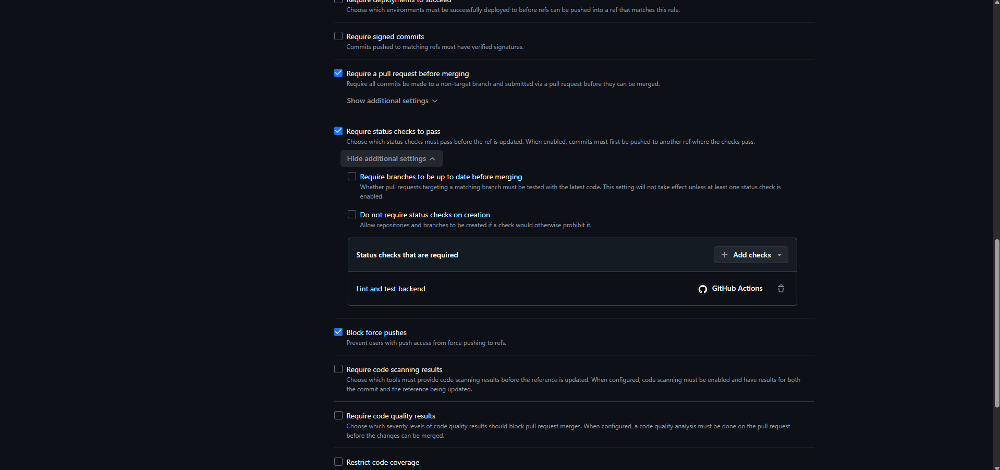
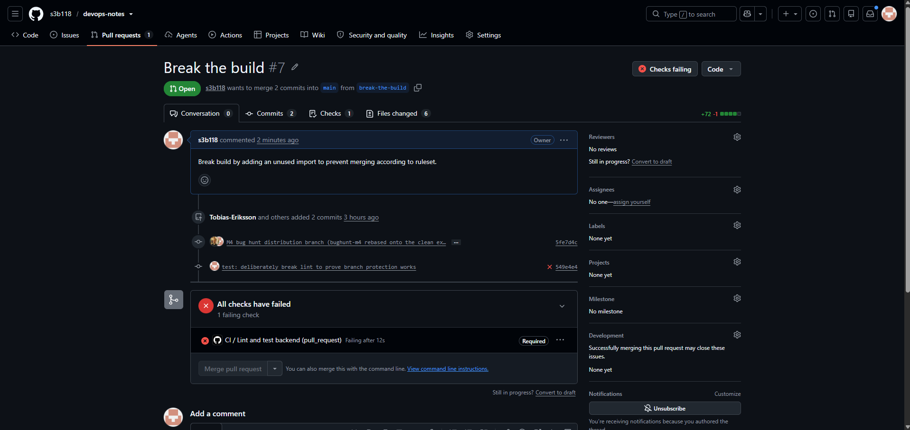
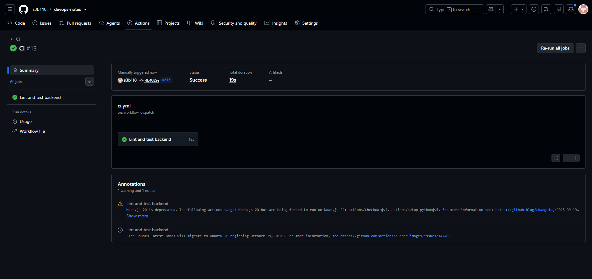

Steg 1:

Skapade en ny regel "lint and test backend" och verifierade att Enforcement status är Active och att bypass-listan är tom.

Steg 2:

Skapade en pull request där poängen var att blockera merging genom att inkludera en oanvänd import.

Steg 4:

Lade till en ett sätt att manuellt starta workflow och verifierade att triggern fungerar.