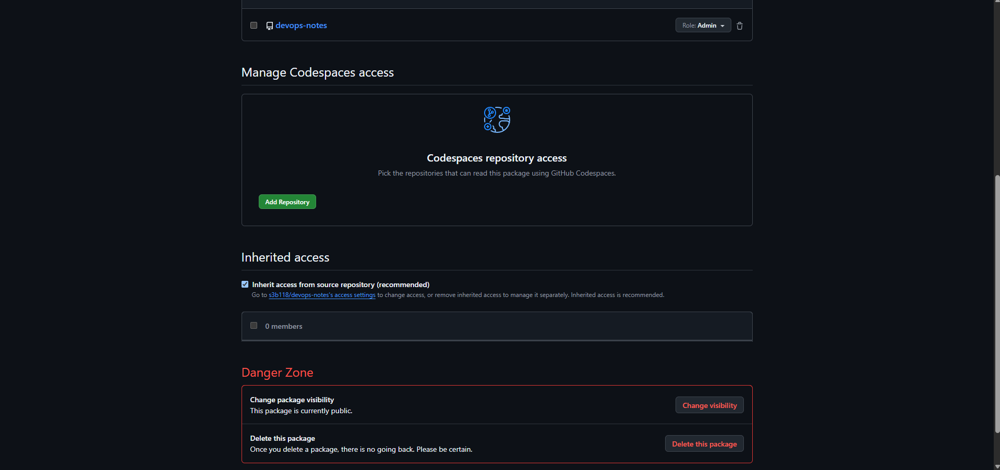
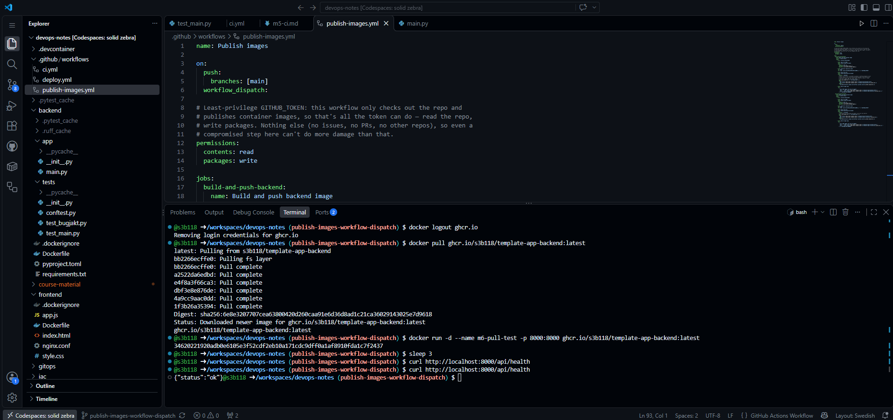
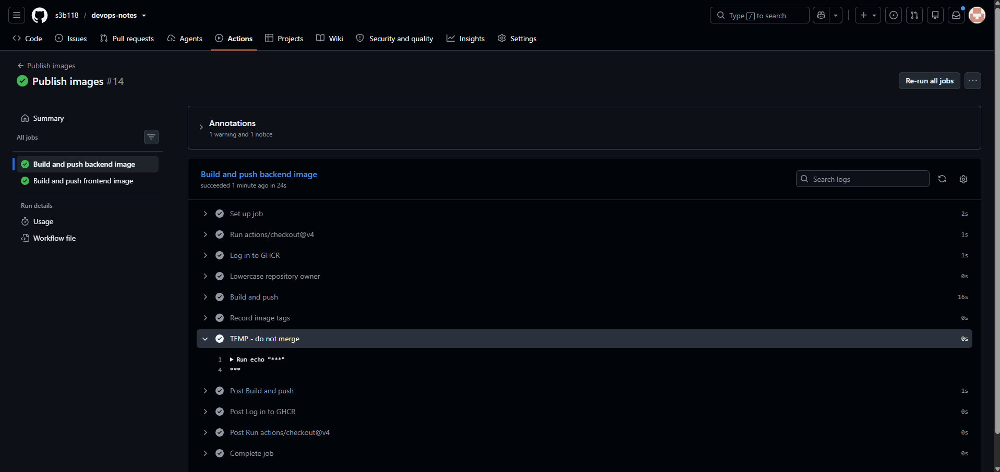

Steg 3:

Verifierade automatisk trigger för publish-images.yml startat av merge-commit. Verifierade också båda jobben och summary/översikt för körningen (tags).

Steg 4:

Verifierade att paketen är publika; hade redan gjort detta i ett tidigare delmoment.

Steg 5:

Loggade ut ur GHCR och testade pull utan inloggning. Verifierade output från konsolen.

Steg 6:

Testade secrets genom ett test med GITHUB_TOKEN (aldrig merge). Verifierade efter build också loggen och att värdet inte visas som klartext och att inget pushas.